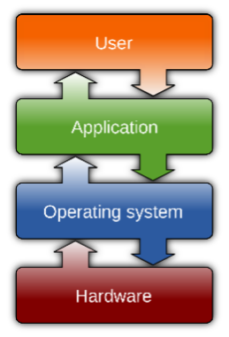
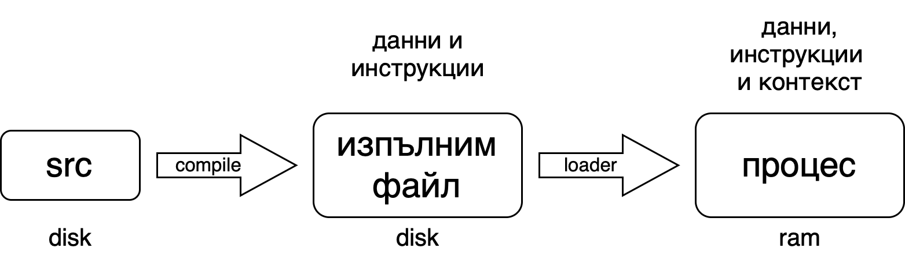
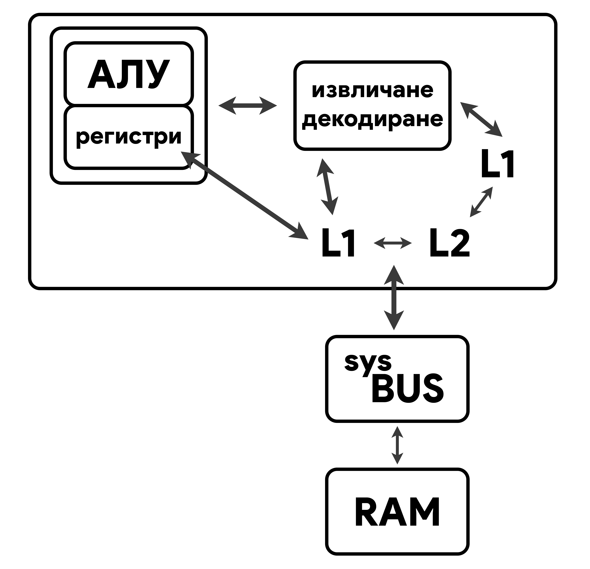
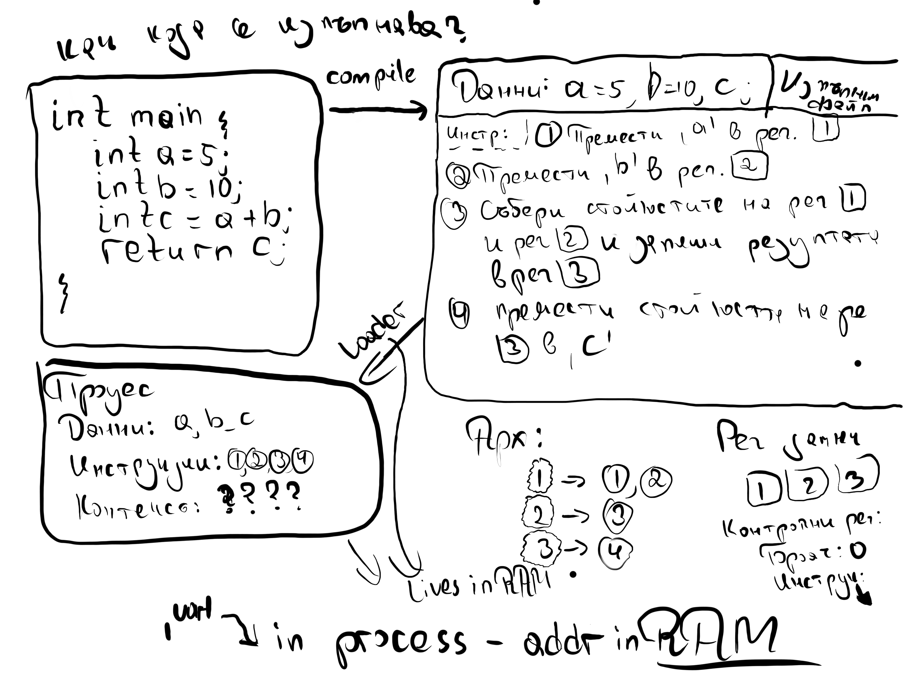

# ✨ Операционни системи ✨

Документация за предмета "Опрерационни системи" (11-ти клас) за учебната **_ТУЕС, 2022/23_** година

## Съдържание

### [Теория](#теория)

1.  [Какво е операционната система?](#какво-е-операционната-система)
    1. [Типове хардуер и техните отговорностти](#типове-хардуер-и-техните-отговорности)
    1. [Работата на ОС](#работата-на-ос)
    1. [Процес - що е то?](#)
    1. [Устройство на централния процесора](#)
       1. [АЛУ](#)
       2. [Памет](#)
          - [Кеш (L3-1)](#)
          - [Регистри](#)
    1. [Видове процеси](#)
    1. [Пример за процес](#)
    1. [Прекъсване](#)
       1. [Софтуерни](#)
       1. [Хардуерни](#)
    1. [Управление на входно-изходни устройства](#)
    1. [Кеширане](#)
1.  [Вътрешно устройство на ОС](#)
    1. [Цели на ОС](#)
       1. [Многозадачност (multitasking)](#)
       1. [Многопотребителност](#)
    1. [Структура](#)
       1. [Ядро (Kernel)](#)
       1. [Обвивка (Shell)](#)
1.  [Видове архитектури на ядрото и виртуализация](#)
    1. [Монолитни ядра](#)
    1. [Многослойни ядра](#)
    1. [Микроядра](#)
    1. [Виртуализация](#)
1.  [Процесите в детайл](#)

---

### [Практика](#практика)

1.  [Macros | Макроси](#macros--макроси)
1.  [Basic Linux команди](#basic-linux-команди)
1.  [Файлове и файлови дескриптори](#файлове-и-файлови-дескриптори)

---

# Теория

## Какво е операционната система?

Операционната система е програма, която има следните 2 задачи:

- да управлява хардуера
- да предоставя интерфес за приложните програми, за да може те да работят с хардуера



### Типове хардуер и техните отговорности

Има 5 типа хардуер, които ще изучаваме този "семестър":

- **_Централнен процесор (CPU - Central Processing Unit)_** - най-важният компонент от един копютър. Изчислява и изпълнява инструкции. Той има за цел да променя данните от паметта под някаква форма.
- **_Оперативна памет (RAM - Random Access Memory)_** - RAM паметта е най-просто казано бърза и енергозависима памет (т.е. ако спре захранването на дадена машина, данните ще бъдат изгубени) и точно, заради това идва и решението на този проблем - съхраняващите устройста. RAM паметта се използва за временно съхранение на изпълняващите програми и данни, които се използват от тях (инструкции, данни и контекст на процес)
- **_Съхраняващи усторйства (Storage Devices)_** - това са сравнително по-бавни устройства за записване и четене на данни, но за разлика от RAM паметта, те са енергонезависими и не се влияят от захранващото състояние на машината. Използват се за дълготрайно съхранение на данни, source code-ове, изпълними файлове и т.н.
- **_Входно-изходни устройства (Input-Output (I/O) Devices)_** - имат за цел да взимат и предават данни (информация) от и на потребителя
- **_Системна шина (System BUS)_** - това е хардуерен компонент, който е междинен слой за комуникация между компонентите. Подобна аналогия е с пътната инфраструктурна мрежа на една държава, която представлява логистичен мост между различните населени места.

### Работата на ОС

Работата на операционната система е ОС е да разделя и управлява хардуера, както и да използва идеята за ресурси. Тази идея представлява интерфейс, който операзионната система използва за приложните програми. Два (2) много важни такива интерфейса (абстракции) са:

- ресурсната абстракция
- файлова абстракция

Пример:

```
malloc() – заделя памет в RAM паметта; работа с файлове.
```

Операционната система също имплементира ред защити за хардуерните устройства. Като примерно не можем да достъпим памет, която не ни принадлежи и т.н.

### Процес - що е то?

Процесът е единствената единица за изпълнение в операционната система. Той представлява програма, която се изпълнява в момента. Процесът съдържа:

Съвкупност от всички операции, които даден процес може да изпълнява се нарича архитектура



- _Loader_ – Това е специална програма, която приема изпълними файлове от Linker-а, зарежда ги в основната памет и подготвя този код за изпълнение от компютър. Loader-ът разпределя място в паметта за програмата. Той отговаря за зареждането на програми и библиотеки в операционната система.

- _Формат на файл_ – информация, която казва как да бъдат имплементирани файловете

- _Процес_ – изпълним файл по време на изпълнение

### Устройство на централния процесор

1. **_АЛУ_** - Аритметико-логическия блок (Arithmetic Logic Unit) - използва se за извършване на аритметични операции и логически операции – събиране, изваждане, умножение, деление и сравняване на две числа. Това устройство обработва данните от регистрите на процесора и контролира скоростта на изчислителния процес. Като реално е изградено от логически елементи - "запоени писти за електрони".

1. **_Регистри (Registers)_** - те са най-бързата памет в една компютърна система и се разделят на 2 вида:

   1. **с общо предазначение** - използват се най-често за временно съхранение на данни (от ОС и приложните програми), от които процесора има най-бърз достъп до. Тези регистри също се делят на 2 подвида - регистри за данни и адресни регистри.
   1. **контролни регистри:** - използват се от ОС за управление на процесите и от самия централен процесор, за да контролира работата си
      - **_Програмен брояч (Program Counter (PC))_** - съхранява поредния номер на следващата инструкция, която трябва да се изпълни
      - **_Регистър за инструкция (Instruction Register (IR))_** - пази се инструкцията, която се изпълнява в момента. Всеки процесор има различен набор от инструкции и затова те си имат зададен номер – т.е. какво прави, примерно: 0 – запиши, 1 – събери и т.н, който зависи от архитектурата.
      - **_Регистър на състоянието (Program Status Word (PSW))_** - в него се съхраняват сервизната информация за операционната систмеа, [мета](https://i.kym-cdn.com/photos/images/original/002/237/750/454.jpg)данни.

1. **_Кеш памет (Cache Memory)_** - това е малка, но доста бърза памет, която се намира вътре във CPU-то. Тя се използва за да се запазят данните, които са използвани най-често, за да се ускори достъпа до тях. Това е доста важно, защото всяко извикване на данни от RAM паметта е доста по-бавно от това да се извика от кеш паметта. Kеш паметта бива L1, L2 и L3 (L3 от около 2000 година)

   - L1 - директно комуникира с регистрите. L1 се разделя на 2 части - L1D (Data) и L1I (Instruction). L1D съхранява данните, които са използвани най-често, а L1I съхранява инструкциите, които са използвани най-често. L1I минава през процес на извличане и декодиране на самите инструкции.
   - L2 & L3 - те представляват медиаторите между L1 и RAM паметта. Те са доста по-бавни от L1 (но и по-големи - L1:KB vs L2/3:MB), но са в пъти по-бързи от RAM паметта.



На схемата е описано как процесорът изпълнява инструкции. Те достигат до него по системната шина. След като достигнат до процесора, те минават през L2 (първо), L1 (различни типове памет, кешпамет) и стигат до хардуера, където биват декодирани. След това отиват към АЛУ, който чете от регистрите (т.е. инструкциите влизат първо там). АЛУ изпълнява посочените в инструкцията действия, след което записва резултатите в посочените в инструкцията координати.

### Видове процеси

Разпределението на пълномощията в ОС се реализира с помощта на съответна процесорна архитектура с два режима на работа:

- **_Привилегирован_** режим на процесора - може да се прави всичко, само Kernel-ът може да работи в този режим; за изпълнимата програма е достъпно цялото адресно пространство.
- **_Непривилегирован_** режим на процесора - може да се изпълнява конкретно подмножество, което процесорът позволява (нашите програми са в такъв режим); достъпността на адресното пространство е ограничено до размери определени при стартиране на програмата.

### Как и къде се изпълнява процеса? (пример)

1. Пази се следната програма на диска (файл - source code):

```c
int main() {
	int a = 5;
	int b = 10;
	int c  = a + b;
	return c;
}
```

2. Компилира се и се получава изпълним файл (executable file), в който се съдържат следните параметри (данни и инструкции):

- данни: a = 5, b = 10 и c (има заделено само памет)
- инструкции:
  1. премести ‘a’ от RAM паметта в регистър 1
  2. премести ‘b’ от RAM паметта в регистър 2
  3. събери стойностите на рег. 1 и 2 и запиши резултата в рег. 3
  4. Премести стойността на рег. 3 в c променливата

3.  Изпълним файл преминава през loader-a и се създава процес, който е поредица от байтове. В този процес се съдържат следните параметри (данни, инструкции, контекст):

- данни: a, b, c (става 15 накрая)
- инструкции: [1] [2] [3] [4] (пише номер на конкретен регистър)
- контекст: ?????

  Като имаме следната архитектура на процеса (номер -> инструкция/и):

  1. -> 1 и 2 (преместване)
  2. -> 3
  3. -> 4
     (т.е. имаме 3 типа инструкции)

Операционната система казва да се изпълни този процес:

- Процесор:
  - Регистри за данни (5; (garbage value); (garbage value)) [в нач. има само garbage val]
  - Контролни:
    - Брояч: 0 (в началото) -> 1
- Инструкция: 1 (след като се декодира инструкцията достигат дотук декодирани)

След това процесът се повтаря: Брояч -> Инструкция -> Записване на резултат в регистъра за данни (това е тялото на цикъла)

Накрая: C = 15;

Процесът и loader-а живеят в RAM паметта.

\*текстова версия на следната снимка:



### Прекъсване и обработка на прекъсване

Това е нормалната работа на процесора. Тя може да бъде прекъсната от Прекъсвания (Interrupt).

Едно прекъсване (interrupt) може или да се игнорира, или да се обработи.

1. Когато се появи прекъсване, процесорът преминава в защитен режим на работа.
1. Като след това трябва да се реши дали ще се обработи това прекъсване.

   - Ако няма да се обработи - преминава се обратно към предходното състояние, преди самото прекъсване.

1. Ако реши да го обработи, първо запазва състоянието си на работа в момента и след това обработва прекъсването (изпълнява конкретна функция (базирано на типа прекъсване, etc.)).
1. След това продължава работата си.
1. Първо проверява дали има нови прекъсвания, подадени в момента на обработване на прекъсването. Прекъсванията се обработват по приоритет.
1. Като се обработят всички прекъсвания, процесорът възстановява нормалния си режим на работа.

За всеки тип прекъсване има Interrupt handler. Прекъсванията се пазят в приоритетна опашка. Interrupt handler се пази в RAM паметта.

**_Прекъсване не може да прекъсне обработката на прекъсване!_**

---

Има както и хардуерни, така и софтуерни прекъсвания.

- Хардуерните

  Хардуерните прекъсвания се получават се от външни хардуерни компоненти, свързани към, или част от компютърната система.

  Примери:

  - Прекъсваия от входно-изходни устройства - за получаване или изпращане на данни или при настъпване на събитие (напр. приключило е дадена операция)
  - Прекъсвания от таймер - времеделни прекъсвани
  - Проблем с някое от хардуерните устройства на компютъра

- Софтуерните

  Софтуерните прекъсвания се получават се при проблеми с изпълнението на инструкциите на даден процес.

  Примери:

  - деление на нула
  - overflow
  - опит за достъп на памет, която не принадлежи на съответния процес
  - при предаване на контрола на ядрото и преминаването на процесора в привилегирован режим и обратно

### Управление на входно-изходни устройства

Операционната система предоставя 3 механизма за работа с входно-изходни устройства:

- Синхронен входно-изходен механизъм (Synchronous I/O)

  Oперационната система изисква от дадено устройство да свърши определена работа и влиза в безкраен цикъл (infinite loop). Като постоянно пита устройството дали си е свършило работата. Този цикъл едва ще приключи (brek-не) чак когато чак когато устройството си свърши работата.Тогава то дава резултата в буфер, който операционната система прехвърля в RAM паметта. Синхронно е, защото ОС не прави нищо друго, освен да чака, докато не получи сигнал, че работата е свършила.

- Асинхронен входно-изходен механизъм (Asynchronous I/O)

  При асинхронния механизъм операционната система отново се допитва до устройството да свърши някаква работа. Но тук идва и разликата от синхронния тип. Докато В/И устройство си върши възложената задача, операционната система е свободна да върши други неща. И чак, когато е готово,устройството, то изпраща прекъсване (interrupt), което, при обработка от процесора, се handle-ва по същия начин като при синхронното: връща се резултат в буфера, който операционната система прехвърля в RAM паметта.

- Директен достъп до паметта (Direct Memory Access)

  При ДДП операционната система казва на дадено устройство не само да изпълни някаква задача, но и да я запише само в RAM паметта и след това да му изпрати прекъсване (interrupt). Понеже не се получава резултат от входно-изходното устройство, при Direct Memory Access няма буфери, защото няма кой да ги обработи и устройството директно пише в паметта. Операционната система получава прекъсване от устройството чак след като то си е свършило работата и е прехвърлило резултата в RAM паметта.

### Кеширане

Кеширането (caching) е принцип, при който информацията (най-нужна от cpu-то) трябва се държи максимално близко до процесора в памет, която има бърз достъп, с цел бързина.

Като така най-нужната информация (данни, инструкции, процеси, т.н.) се държи в най-бързата памет, най-близо до процесора, за да няма забавяния. Проблемът възниква, когато погледнем пазара и днешните технологични процеси (скорост, обем и бързина).

Най-бързата памет са регистрите, последвани от L1 кеш, след това L2, L3, RAM паметта и така до storage устройствата. Обратното може да се каже за цената на паметта за един байт, където регистрите не могат да се сравняват с мегабайтите на кеш паметта, както и кеш паметта не може да се сравнява с гигабайтите на RAM паметта и т.н.

Това е причината да има пъти по-малко регистри и кеш от RAM паметта. Което ни довежда, че кеширането трябва да е наистина оптимално и да се използва възможно най-много. Fun fact - кеш паметта всъщност заема най-много пространство от силиция на един процесор.

---

## Вътрешно устройство на операционната система

---

## Видове архитектури на операционни системи и виртуализация

---

## Процесите в детайл

---

# Практика

## Macros | Макроси

## Basic Linux команди

- `whoami` - "Who am I? 😮" - връща името на текущия потребител

  

- `pwd` - "Print work directory" - посочва директорията, в която се намираме

  

- `ls` - "List" - дава информация за това какви файлове и директории има в текущата директория

  

- `mkdir <name>` - "Make directory" - създава директория на име <name> там, където се намираме

  

- `mv` <src> <dest> - "Move" - премества избрания файл на дадена локация (може да се използва и за преименуване на дадения файл) (може да се използва и за директории)

- `cp <src> <dest>` - "Copy" - копира избрания файл на дадена локация (може да се използва и за директории)

- `cd` - "Change Directory" - премества потебителя в дадена директория

  - `cd <name>` - премества потребитя в подадената от него директория с път <name>

    

  - `cd ..` - премества потребителя с една директория нагоре (във "файловото дърво" - file structure tree)

    

  - `cd .` - "премества" потребителя в текущата директория

    

  - `cd /` - премества потребителя в **ROOT** директорията

    

  - `cd ~` - премества потребителя в съответната за него **HOME** (потребителска) директория

    

- `touch <name>` - създава файл на име <name> без да го отваря

  

- `cat <name>` - "Concatenate" - извежда (конкатенира) стойността на даден файл

  

- `man` - "Manual page" - документация за функции и команди

  - `man <name>` - "General commands menu" - документация за обикновени функции и команди

    

  - `man 2 <name>` - System calls menu - документация за системни функции и команди (System Calls - системни повиквания)

    

- `vim <name>` - vim (което означава vi (стар текстов редактор) improved) е изключително **_основан_** текстов редактор за терминал (btw води се за един от най-ефикасните и мощни редактори) - чрез тази команда или създаваме и отваряме за редактиране файл <name>, или само отваряме вече съществуващ файл <name>

       

  

- `nano <name>` - изключително опростен текстов редактор, който "върши работата". Най-често се използва за редактиране на кофигурационни файлове. Тази команда върши всичко аналогично на vim само че с nano

       

  

---

## Файлове и файлови дескриптори

Функции, които ще учим за файлове:

- open
- close
- read
- write
- lseek

---

## Работа с байтове и комуникация

### Endianness

- little endian

- big endian

### <stdint.h>

- uint8_t

- uint16_t

- uint32_t

- uint64_t

### Bob & Alice

### Видове комуникация

- shared memory
- pipes
- sockets
- signals
- files
