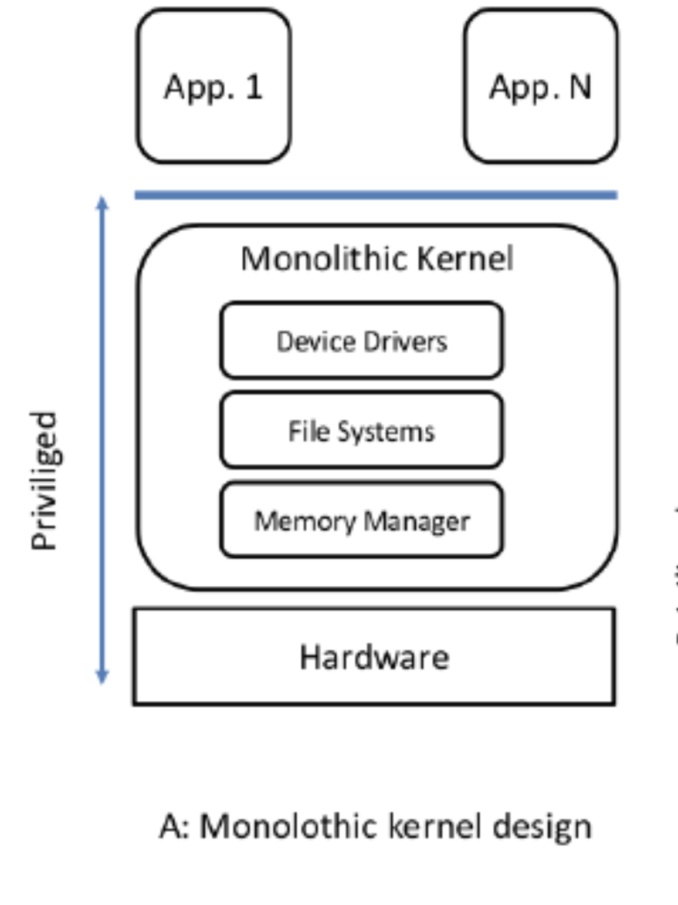

# ✨ Операционни системи ✨

Документация за предмета "Опрерационни системи" (11-ти клас) за учебната **_ТУЕС, 2022/23_** година

## Съдържание

### [Теория](#теория)

1.  [Какво е операционната система?](#какво-е-операционната-система)
    1. [Типове хардуер и техните отговорностти](#типове-хардуер-и-техните-отговорности)
    1. [Работата на ОС](#работата-на-ос)
    1. [Процес - що е то?](#процес---що-е-то)
    1. [Устройство на централния процесора](#устройство-на-централния-процесор)
       1. АЛУ
       2. Памет
          - Кеш (L3-1)
          - Регистри
    1. [Видове процеси](#видове-процеси)
    1. [Пример за процес](#как-и-къде-се-изпълнява-процеса-пример)
    1. [Прекъсване](#прекъсване-и-обработка-на-прекъсване)
       1. Какво е прекъсване?
       1. Обработка на прекъсване
       1. Видове прекъсвания
          - Софтуерни
          - Хардуерни
    1. [Управление на входно-изходни устройства](#управление-на-входно-изходни-устройства)
       1. Синхронен входно-изходен механизъм (Synchronous I/O)
       1. Асинхронен входно-изходен механизъм (Asynchronous I/O)
       1. Директен достъп до паметта (Direct Memory Access)
    1. [Кеширане](#кеширане)
1.  [Вътрешно устройство на ОС](#вътрешно-устройство-на-операционната-система)
    1. [Цели на ОС](#цели-на-ос)
       1. Многозадачност (multitasking)
       1. Многопотребителност
    1. [Структура](#структура)
       1. [Ядро (Kernel)](#)
       1. [Обвивка (Shell)](#)
    1. [Ядрото](#ядрото)
    1. [Обвивката](#обвивката-shell)
    1. [Системни повиквания (System Calls)](#системни-повиквания-system-calls)
1.  [Видове архитектури на ядрото и виртуализация](#видове-архитектури-на-операционни-системи-и-виртуализация)
    1. [Монолитни ядра](#монолитни-ядра-monolithic-kernels)
    1. [Многослойни ядра](#многослойни-ядра-layered-kernels)
    1. [Микроядра](#микроядра-microkernels)
    1. [Виртуализация](#виртуализация)
1.  [Процесите в детайл](#процесите-в-детайл)

---

### [Практика](#практика)

1.  [Macros | Макроси](#macros--макроси)
1.  [Basic Linux команди](#basic-linux-команди)
1.  [Файлове и файлови дескриптори](#файлове-и-файлови-дескриптори)

---

# Теория

## Какво е операционната система?

Операционната система е програма, която има следните 2 задачи:

- да управлява хардуера
- да предоставя интерфес за приложните програми, за да може те да работят с хардуера


### Типове хардуер и техните отговорности

Има 5 типа хардуер, които ще изучаваме този "семестър":

- **_Централнен процесор (CPU - Central Processing Unit)_** - най-важният компонент от един копютър. Изчислява и изпълнява инструкции. Той има за цел да променя данните от паметта под някаква форма.
- **_Оперативна памет (RAM - Random Access Memory)_** - RAM паметта е най-просто казано бърза и енергозависима памет (т.е. ако спре захранването на дадена машина, данните ще бъдат изгубени) и точно, заради това идва и решението на този проблем - съхраняващите устройста. RAM паметта се използва за временно съхранение на изпълняващите програми и данни, които се използват от тях (инструкции, данни и контекст на процес)
- **_Съхраняващи усторйства (Storage Devices)_** - това са сравнително по-бавни устройства за записване и четене на данни, но за разлика от RAM паметта, те са енергонезависими и не се влияят от захранващото състояние на машината. Използват се за дълготрайно съхранение на данни, source code-ове, изпълними файлове и т.н.
- **_Входно-изходни устройства (Input-Output (I/O) Devices)_** - имат за цел да взимат и предават данни (информация) от и на потребителя
- **_Системна шина (System BUS)_** - това е хардуерен компонент, който е междинен слой за комуникация между компонентите. Подобна аналогия е с пътната инфраструктурна мрежа на една държава, която представлява логистичен мост между различните населени места.

### Работата на ОС

Работата на операционната система е ОС е да разделя и управлява хардуера, както и да използва идеята за ресурси. Тази идея представлява интерфейс, който операзионната система използва за приложните програми. Два (2) много важни такива интерфейса (абстракции) са:

- ресурсната абстракция
- файлова абстракция

Пример:

```
malloc() – заделя памет в RAM паметта; работа с файлове.
```

Операционната система също имплементира ред защити за хардуерните устройства. Като примерно не можем да достъпим памет, която не ни принадлежи и т.н.

### Процес - що е то?

Процесът е единствената единица за изпълнение в операционната система. Той представлява програма, която се изпълнява в момента. Процесът съдържа:

Съвкупност от всички операции, които даден процес може да изпълнява се нарича архитектура


- _Loader_ – Това е специална програма, която приема изпълними файлове от Linker-а, зарежда ги в основната памет и подготвя този код за изпълнение от компютър. Loader-ът разпределя място в паметта за програмата. Той отговаря за зареждането на програми и библиотеки в операционната система.

- _Формат на файл_ – информация, която казва как да бъдат имплементирани файловете

- _Процес_ – изпълним файл по време на изпълнение

### Устройство на централния процесор

1. **_АЛУ_** - Аритметико-логическия блок (Arithmetic Logic Unit) - използва se за извършване на аритметични операции и логически операции – събиране, изваждане, умножение, деление и сравняване на две числа. Това устройство обработва данните от регистрите на процесора и контролира скоростта на изчислителния процес. Като реално е изградено от логически елементи - "запоени писти за електрони".

1. **_Регистри (Registers)_** - те са най-бързата памет в една компютърна система и се разделят на 2 вида:

   1. **с общо предазначение** - използват се най-често за временно съхранение на данни (от ОС и приложните програми), от които процесора има най-бърз достъп до. Тези регистри също се делят на 2 подвида - регистри за данни и адресни регистри.
   1. **контролни регистри:** - използват се от ОС за управление на процесите и от самия централен процесор, за да контролира работата си
      - **_Програмен брояч (Program Counter (PC))_** - съхранява поредния номер на следващата инструкция, която трябва да се изпълни
      - **_Регистър за инструкция (Instruction Register (IR))_** - пази се инструкцията, която се изпълнява в момента. Всеки процесор има различен набор от инструкции и затова те си имат зададен номер – т.е. какво прави, примерно: 0 – запиши, 1 – събери и т.н, който зависи от архитектурата.
      - **_Регистър на състоянието (Program Status Word (PSW))_** - в него се съхраняват сервизната информация за операционната систмеа, [мета](https://i.kym-cdn.com/photos/images/original/002/237/750/454.jpg)данни.

1. **_Кеш памет (Cache Memory)_** - това е малка, но доста бърза памет, която се намира вътре във CPU-то. Тя се използва за да се запазят данните, които са използвани най-често, за да се ускори достъпа до тях. Това е доста важно, защото всяко извикване на данни от RAM паметта е доста по-бавно от това да се извика от кеш паметта. Kеш паметта бива L1, L2 и L3 (L3 от около 2000 година)

   - L1 - директно комуникира с регистрите. L1 се разделя на 2 части - L1D (Data) и L1I (Instruction). L1D съхранява данните, които са използвани най-често, а L1I съхранява инструкциите, които са използвани най-често. L1I минава през процес на извличане и декодиране на самите инструкции.
   - L2 & L3 - те представляват медиаторите между L1 и RAM паметта. Те са доста по-бавни от L1 (но и по-големи - L1:KB vs L2/3:MB), но са в пъти по-бързи от RAM паметта.


На схемата е описано как процесорът изпълнява инструкции. Те достигат до него по системната шина. След като достигнат до процесора, те минават през L2 (първо), L1 (различни типове памет, кешпамет) и стигат до хардуера, където биват декодирани. След това отиват към АЛУ, който чете от регистрите (т.е. инструкциите влизат първо там). АЛУ изпълнява посочените в инструкцията действия, след което записва резултатите в посочените в инструкцията координати.

### Видове процеси

Разпределението на пълномощията в ОС се реализира с помощта на съответна процесорна архитектура с два режима на работа:

- **_Привилегирован_** режим на процесора - може да се прави всичко, само Kernel-ът може да работи в този режим; за изпълнимата програма е достъпно цялото адресно пространство.
- **_Непривилегирован_** режим на процесора - може да се изпълнява конкретно подмножество, което процесорът позволява (нашите програми са в такъв режим); достъпността на адресното пространство е ограничено до размери определени при стартиране на програмата.

### Как и къде се изпълнява процеса? (пример)

1. Пази се следната програма на диска (файл - source code):

```c
int main() {
	int a = 5;
	int b = 10;
	int c  = a + b;
	return c;
}
```

2. Компилира се и се получава изпълним файл (executable file), в който се съдържат следните параметри (данни и инструкции):

- данни: a = 5, b = 10 и c (има заделено само памет)
- инструкции:
  1. премести ‘a’ от RAM паметта в регистър 1
  2. премести ‘b’ от RAM паметта в регистър 2
  3. събери стойностите на рег. 1 и 2 и запиши резултата в рег. 3
  4. Премести стойността на рег. 3 в c променливата

3.  Изпълним файл преминава през loader-a и се създава процес, който е поредица от байтове. В този процес се съдържат следните параметри (данни, инструкции, контекст):

- данни: a, b, c (става 15 накрая)
- инструкции: [1] [2] [3] [4] (пише номер на конкретен регистър)
- контекст: ?????

  Като имаме следната архитектура на процеса (номер -> инструкция/и):

  1. -> 1 и 2 (преместване)
  2. -> 3
  3. -> 4
     (т.е. имаме 3 типа инструкции)

Операционната система казва да се изпълни този процес:

- Процесор:
  - Регистри за данни (5; (garbage value); (garbage value)) [в нач. има само garbage val]
  - Контролни:
    - Брояч: 0 (в началото) -> 1
- Инструкция: 1 (след като се декодира инструкцията достигат дотук декодирани)

След това процесът се повтаря: Брояч -> Инструкция -> Записване на резултат в регистъра за данни (това е тялото на цикъла)

Накрая: C = 15;

Процесът и loader-а живеят в RAM паметта.

\*текстова версия на следната снимка:


### Прекъсване и обработка на прекъсване

Това е нормалната работа на процесора. Тя може да бъде прекъсната от Прекъсвания (Interrupt).

Едно прекъсване (interrupt) може или да се игнорира, или да се обработи.

1. Когато се появи прекъсване, процесорът преминава в защитен режим на работа.
1. Като след това трябва да се реши дали ще се обработи това прекъсване.

   - Ако няма да се обработи - преминава се обратно към предходното състояние, преди самото прекъсване.

1. Ако реши да го обработи, първо запазва състоянието си на работа в момента и след това обработва прекъсването (изпълнява конкретна функция (базирано на типа прекъсване, etc.)).
1. След това продължава работата си.
1. Първо проверява дали има нови прекъсвания, подадени в момента на обработване на прекъсването. Прекъсванията се обработват по приоритет.
1. Като се обработят всички прекъсвания, процесорът възстановява нормалния си режим на работа.

За всеки тип прекъсване има Interrupt handler. Прекъсванията се пазят в приоритетна опашка. Interrupt handler се пази в RAM паметта.

**_Прекъсване не може да прекъсне обработката на прекъсване!_**

---

Има както и хардуерни, така и софтуерни прекъсвания.

- Хардуерните

  Хардуерните прекъсвания се получават се от външни хардуерни компоненти, свързани към, или част от компютърната система.

  Примери:

  - Прекъсваия от входно-изходни устройства - за получаване или изпращане на данни или при настъпване на събитие (напр. приключило е дадена операция)
  - Прекъсвания от таймер - времеделни прекъсвани
  - Проблем с някое от хардуерните устройства на компютъра

- Софтуерните

  Софтуерните прекъсвания се получават се при проблеми с изпълнението на инструкциите на даден процес.

  Примери:

  - деление на нула
  - overflow
  - опит за достъп на памет, която не принадлежи на съответния процес
  - при предаване на контрола на ядрото и преминаването на процесора в привилегирован режим и обратно

### Управление на входно-изходни устройства

Операционната система предоставя 3 механизма за работа с входно-изходни устройства:

- Синхронен входно-изходен механизъм (Synchronous I/O)

  Oперационната система изисква от дадено устройство да свърши определена работа и влиза в безкраен цикъл (infinite loop). Като постоянно пита устройството дали си е свършило работата. Този цикъл едва ще приключи (brek-не) чак когато чак когато устройството си свърши работата.Тогава то дава резултата в буфер, който операционната система прехвърля в RAM паметта. Синхронно е, защото ОС не прави нищо друго, освен да чака, докато не получи сигнал, че работата е свършила.

- Асинхронен входно-изходен механизъм (Asynchronous I/O)

  При асинхронния механизъм операционната система отново се допитва до устройството да свърши някаква работа. Но тук идва и разликата от синхронния тип. Докато В/И устройство си върши възложената задача, операционната система е свободна да върши други неща. И чак, когато е готово,устройството, то изпраща прекъсване (interrupt), което, при обработка от процесора, се handle-ва по същия начин като при синхронното: връща се резултат в буфера, който операционната система прехвърля в RAM паметта.

- Директен достъп до паметта (Direct Memory Access)

  При ДДП операционната система казва на дадено устройство не само да изпълни някаква задача, но и да я запише само в RAM паметта и след това да му изпрати прекъсване (interrupt). Понеже не се получава резултат от входно-изходното устройство, при Direct Memory Access няма буфери, защото няма кой да ги обработи и устройството директно пише в паметта. Операционната система получава прекъсване от устройството чак след като то си е свършило работата и е прехвърлило резултата в RAM паметта.

- **_Spooling_** - концепция за работа с I/O устройства, където разбиваме данните и/ли работата, която трябва да бъде свършена на малки части / компоненти, базирано на размера на буфера на самото входно-изходно устройство. След това подаваме тези части една по една на устройството. Тази концепция е създадена, за да се избегнат следните проблеми:

  - ценови проблем, където едно В/И устройство би изисквало изключително голям капацитет на буфер
  - непредвидимост - никой не може да предвиди точно какъв капацитет ще "угоди" на всички.
  - и още

  За пример може да се вземе един принтер, не само че всеки документ има различен брой страници, но и самите те имат свой собствен размер. Примерно един принтер може да има буфер от 128MB, но документът, който трябва да отпечата е в пъти по-голям. И затова данните се разбиват на chunk-ове и се подават на принтера.

### Кеширане

Кеширането (caching) е принцип, при който информацията (най-нужна от cpu-то) трябва се държи максимално близко до процесора в памет, която има бърз достъп, с цел бързина.

Като така най-нужната информация (данни, инструкции, процеси, т.н.) се държи в най-бързата памет, най-близо до процесора, за да няма забавяния. Проблемът възниква, когато погледнем пазара и днешните технологични процеси (скорост, обем и бързина).

Най-бързата памет са регистрите, последвани от L1 кеш, след това L2, L3, RAM паметта и така до storage устройствата. Обратното може да се каже за цената на паметта за един байт, където регистрите не могат да се сравняват с мегабайтите на кеш паметта, както и кеш паметта не може да се сравнява с гигабайтите на RAM паметта и т.н.

Това е причината да има пъти по-малко регистри и кеш от RAM паметта. Което ни довежда, че кеширането трябва да е наистина оптимално и да се използва възможно най-много. Fun fact - кеш паметта всъщност заема най-много пространство от силиция на един процесор.

---

## Вътрешно устройство на операционната система

### Цели на ОС

- **_Многозадачност_** - Операционната система създава илюзия (абстракция) за паралелно изпълнение на програми. Обаче в реалността\* обработката на инструкции е последователна. разделя работата за изключително бърз период от милисекунди. Илюзията за многозадачност (паралелно изпълнение) се постига чрез използване на таймери, които генерират прекъсвания на определено време (интервал). Тези прекъсвания сменят процеса (задачата), която се изпълнява.

  \*технически в реалността се изпълнпват и много задачи, ако процесорът е многоядерен (и може би ако има няколко логически ядра (не съм сигурен за лог. ядрата обаче)).

  Иначе цялото това нещо (илюзията) се постига благодарение на невероятната скорост на днешните процесори. (говоря за едноядерни процесори тук :))

- **_Многопотребителност_** - в реална среда компютрите се използват от много потребители. Многопотребителността е способността на операционната система да поддържа различни (множество) потребители. Като така се постига енкапсулация. Дадени потребители да имат достъп до дадени файлове и директории. Както и всеки потребител да си има права / правомощия. В GNU+Linux има 2 типа потребители: привилегирован (root) и непривилегирован.

- **_Времеделение_** - това е разделянето на процесорното време между отделните процеси, които се изпълняват. Както вече споменахме, това се използва именно в многозадачността, тъй като на един процесор в дадено време може да се изпълнпва само един процес. Процесите изпълняващи се на един процесор се сменят на много кратко време, в зависимост от приоритета им, като времеделението се извършва чрез таймери, които генерират прекъсвания на определено време (интервал). Тези прекъсвания сменят процеса (задачата), която се изпълнява за крато и този процес "времеделение" се повтаря.

### Структура

Операционната система може да се раздели на две части:

- Ядрото (Kernel) - най-ниското ниво на една операционна система, то се грижи за управлението на различните части на една компютърна система - т.е. директно управлява хардуера. Това е единственият компонент, който може да работи в привилегиран режим (privileged mode). Ядрото съдържа всички драйвери за устройствата, които се намират в компютърната система. Ядрото съдържа и всички вътрешни функции (system calls - системни повиквания), които се използват от другите части на операционната система.

- Обвивката (Shell) - командния интерпретатор е набор от приложни програми, които знаят как да говорят с ядрото чрез системни извиквания, които то предоставя както и на обвивката, така и на приложните програми. Предоставя среда и интерфейс за улеснена работа с операционната, както на хора, така и на други приложни програми.


### Ядрото

Ядрото може да се раздели на 5 части:

- Управление на процесите (Process Management)

  **Процесът** е програма по време на нейното изпълнение. Т.е. работата на процеса е да "хване" инструкциите на дадена програма отгоре надолу и след като свърши да се **терминира**. От една програма може да има множество процеси, които може да се изпълняват едновременно или един след друг. Но във всеки един момент всеки един процес може да изпълнява точно една програма. Абстракция на операционната система е, че всеки процес се асоциира с една програма.

  Операционната система може да прави няколко неща с процесите:

  - да **създава** процеси
  - да **терминира** / унищожава процеси (спешно да го убие)
  - да **спира** процеси (напр., ако имаме по-приоритетна задача (процес), като го вкара в "затвора" и да не използва ресурси - реално все едно процесът е паузиран)
  - да ги **стартира** наново / продължава процеси (след като ОС ги е спряла)

  Операционната система предоставя механизми за синхронизация и комуникация между процесите.

  - **Комуникация** – да се прехвърлят данни между процесите.
  - **Синхронизация** между процесите (при 1 ядро) – многонишково изпълнение.

  Нашите програми се изпълняват от нишки. Ние можем да кажем на операционната система, че искаме нашата програма да се изпълнява не от една, а от няколко нишки.

  Нишките са софтуерни, _абстракцията_, че процесът има _нишка_ не е хардуерно лимитирана и ОС създава _илюзията_ – т.е. дори и да се изпълняват _последователно_ – пак са нишки (при едноядрен процесор) (чрез времеделение). А когато са на хардуерно ниво, нишките се извършват _паралелно_ и така се спестява _пъти време_.

  Нишките са просто работници. На колко нишки се изпълнява програмата се _определя от програмиста_, както и за какво се използва. Може също да имаме работа с _динамични нишки_, това означава, че част от кода може да се изпълнява само на една нишка, докато друга на 5, а пък трета на 6 и т.н. За повече нишки трябва да се _обърнем към операционната система_ със системно повикване.

  Всяка нища се свързва с **отделен PC** (Programming Counter - т.е. винаги помни докъде е стигнала), за да помни до къде е стигнала. Всяка _нишка също се асоциира с един процес_, но един _процес може да се асоциира с няколко нишки_. Нишките **споделят ресурси**. И когато дадена нишка си свърши работата, тя умира.

  **_(def) Нишката представлява единица за изпълнение на процес. Нишките са абстракцията, която ОС използва, за да разпредели процесорното време_**

- Управление на паметта (Memory Management)

Управление на паметта (RAM) -> RAM паметта е огромен масив от байтове; енергозависим. ОС се грижи всички процеси да стигнат до RAM паметта и оттам до процесора. Резултатите на процесора също се записват в RAM. Ядрото има 3 функции, когато работи с паметта: да заделя и освобождава оперативна памет, когато е нужно; да следи кои части от паметта на кои процеси са; да решава кои данни и процеси трябва да са в RAM паметта

o RAM – огромен масив от байтове
o Всички инструкции, които процесора изпълнява и данните, които трябва да се записват, трябва да минат през рам паметта (както и резултатите от процесиите) преди да отидат в харда
o Да заделя и освобождава памет, когато е нужно
o Ядрото решава кои процеси и данни трябва да са в РАМ в момента
o Трябва да освобождава части от паметта, когато е нужно

- Управление на входно-изходните устройства (I/O Management)

Управление на I/О устройства -> Всяко устройство има драйвер (програма, която знае как да работи точно с това устройство). Ядрото предоставя единен интерфейс за работа с типове устройства. Входно-изходната система също така кешира информация. Тази система има др. важна задача – spooling (концепция, при която се разделя работата на входно-изходното устройство на малки части заради хардуерни лимитации; пример: принтер и голям материал за принтене). Интерфейсът е конвенция; набор от правила. Устройства не знаят за този интерфейс. Драйверите са посредника между устройствата и интерфейса. Работа с I/O устройства се изпълнява с инструкции, които не могат да бъдат изпълнени в непривилегирован режим. Само ОС може да работи с хардуерната система директно.
Ядро <-> интерфейс <-> драйвер <-> буфер|устройство

o Входно изходната система с буфери и кеширане
o Драйвери и управление на устройствата
o Как да запише / прочете и разбере тези байтове от устройствата. Всяко устройство има драйвер – програма, която знае как да работи с даден модел устройство. Ядрото предоставя един интерфейс (конвенция, начин на работа) за работа с такива устройства. Драйверът знае как да говори с у-во и с ОС (чрез интерфеса). Интерфейсът е част от ядрото.
o Ядро <- интерфейс <-> драйвер буфер и устройство
o ОС управа буфера на това устройство. Не взима тази информация моментално и затова ядрото управлява тези буфери.
o Кеширане на информация – в кеш, рам , регистър, тъй като буферите са много бавни
o Spooling – последната – концепция, методология, идея. Проблемът с устройствата е, че буферът е с ограничен размер. Устройствата само четат буфера. Когато не е достатъчен И/О системата на ядрото се грижи за това да запълва постоянно буфера, ако не е достатъчен – разделяме работата на малки части. Това съществува, поради хардуерните лимитации на бавните входно-изходни устройства.

- Управление на външно-запаметяващите устройства (Storage Management)

Управление на външни запаметяващи устройства -> Тези устройства се използват за съхранение на данни, които искаме да оцелеят при спиране на системата и които не се побират за RAM-а. Типове: WORM (Записвайте веднъж четете много (WORM) описва устройство за съхранение на данни, в което информацията, веднъж написана, не може да бъде модифицирана. Тази защита срещу запис гарантира, че данните не могат да бъдат подправени, след като бъдат записани на устройството), RW. Хардуерните устройства се различават по скорост, обем и начин на работа. Целта на ядрото е да скрие тези различия. За нас всичко е различни файлове, поредица от файлове. Файлова система – съвкупност от файлове, директории и правата за достъп до тези файлове и директории. Целта на директориите е организираност. Ядрото реализира две абстракции: файл и файлова система, които позволяват да се управляват външни запаметяващи устройства. ОС може да създава, трие, мести, променя съдържание, да променя правата за достъп.

o Съхранение на данни, които искаме да оцелеят след изключване и
o WORM – пишем веднъж и много, много четем
o RW – писане и четане
o Архивиране – специални устройства – устройства, които ще изчезнат – много бавни, но reliable. За долгосрочно
o Създава се концепцията за файл, за да ни е по-лесно. Файлът е лъжа, илюзия, реално е поредица от байтове. Една от тази работа, която ОС си играе е, че някои у-ва са по-бавни в първите бавни, отколкото по средата / края.
o Друга абстракция за организиране на байтове – файловата система. Структуриране на байтове, директории, файлове, права за достъп до тези директории, организация и т.н.
o ОС може да създава, трие, преименува, променя… файлове и директории

- Имплементация на защитна сигурност (Security)

Имплементация на защита и сигурност -> Защита – всеки механизъм на ОС, който контролира достъпа на потребители до процеси. Има два типа защити: хардуерни (примери: съществуването на двата режима на работа – привилегирован и непривилегирован; има хардуерни защити за това кои байтове от RAM паметта могат да бъдат достъпвани в непривилегирован режим; таймерите на процесора са др. пример, т.е. един таймер не може да работи постоянно) и софтуерни (примери: правилата за достъп до файлове и директории; всеки процес се асоциира с точно определена памет, ако достъпи памет, която не му принадлежи, процесът биват убит).

o Защита се нарича всеки механизъм, който контролира достъпа на потребителите и процесите
o Хардуерни (4 са)
 Съществуването на привилегирован и непривилегирования режим има само набор от инструкции
• Да не се прецака ядрото и ОС
 ОС се намира в RAM – тя е защитена на хардуерно ниво – на това кои байтове мое да се достъпват от при неприв режм
• Има регистри, които определят тези адреси – BASE, LIMIT
 Таймерите на процесора – също защита – генерира се прекъсване, за да се премахне насилствено процес, за да се даде достъп до ОС  
 Работата с в/и у-ва не може да се изпълняват в непр режим => използва се ядрото като middle man (хардуерна защита)
o Софтуерни (3)
 Само ядрото работи в привилегирован режим
 Кой потебител с кои файлове
 Всеки процес се асоциира с определено парче памет

### Обвивката (Shell)

Обвивката (shell) – набор от приложни програми, които знаят как да си говорят с ядрото. Приложен софтуер. Реално единственият плюс, е че някои ги е написал.

### Системни повиквания (System calls)

Комуникация между ядро и shell – системни извиквания (интерфейс).
Как се превключва от user space и kernel space. Ситемно извикване – предаваме контрол към ядрото. МЕГА КЛЮЧОВО

Системните извиквания са функции, предоставени от операционната система, които се използват от приложните програми от userspace-а, за да си комуникират с ядрото, което пък се изпълнява в kernel space-а. Това се прави, за да могат обикновените приложни програми с изключително ограничени права да изпълняват операции, които са невъзможни за изпълнение в userspace-а. Това се прави с цел защита на системата. Basically чрез ситемните извиквания предаваме контрол към ядрото.

Примери биват работа с файлове и потоци `open()`, `read()`, `write()`, `lseek()`, `close()` (и др.), управление на процеси `fork()`, `exit()` и т.н:

### Какво е файл?

При управлението на външно-запаметяващите устройства от ядрото, файлът е създаден като абстракция, илюзия, лъжа, създадена за да се улесни работата с данни.

Реално файлът представлява поредица от байтове на storage устройството, която бива интерпретирана по определен начин в зависимост от файловата система.

### Какво е файлова система?

Файловата система също е абстракция за организирането на байтовете. Структуриране на байтове, директории, файлове, права за достъп до тези директории, организация и т.н.

### Какви операции можем да извършваме с/в-ху файлове?

Файловата система позволява на потребителите да създават, изтриват, четат, пишат, преименуват, местят файлове и директории. Но това зависи дали имаме права за това. Правата са разделени на 3 групи:

- Потребителски права
- Групови права
- Други права

Но дотук ще спомена, тъй като е извън материала. Накратко файловата система ни дава възможност да създаваме, изтриваме, преименуваме, променяме, копираме файлове и директории, но там само където имаме права.

### Какви видове защити има? Дайте по поне два примера за всеки.

Oперационната система предоставя защита, която представлява механизъм, който контролира достъпа на потребителите и процесите. Като се разделя на 2 части:

1.  Хардуерна защита

    - Съществуването на привилегирован и непривилегирования режим, който има само набор (изключително малък) от инструкции
    - Операционната система се намира в RAM паметта – тя е защитена на хардуерно и софтуерно ниво. На хардуерно ниво е посочено на това кои байтове мое да се достъпват от неприлегирования и от привилегирования режим. - Има регистри, които определят тези адреси – BASE, LIMIT
    - Таймерите на процесора също са защита – генерира се прекъсване, за да се премахне насилствено процес, за да се даде достъп до операционната система
    - Работата с в/и у-ва не може да се изпълняват в неприлегирования използва се ядрото като middle man (? за това съм леко несигурен дали е хардуерна или софтуерна защита)

2.  Софтуерна защита

    - Само ядрото работи в привилегирован режим
    - Правилата за достъп на файловата система за всеки потребител
    - Всеки процес се асоциира с определено парче памет

### Какво е команден интерпретатор?

Командния интерпретатор, по-известен като обвивка (shell), представлява набор от приложни програми, които някой вече е написал, и които знаят как да си говорят с ядрото. Комуникацията между тази съвкупност от програми и ядрото се случва на база интерфейс, който се нарича системи извиквания.

Той е видимият потребителски интерфейс на операционната. Обикновено се зарежда върху нея и предлага на потребителите команди, които им осигуряват достъпа до операционната система - примерно както GNU+Linux са неразделни части на една цяла система - GNU - shell, Linux - kernel.

---

## Видове архитектури на операционни системи и виртуализация

Когато работим с много код, този код се структурира по някакъв начин. Това структуриране се нарича архитектура. Когато работим с голямо количество код. Този код се структурира по някъде начин. Този начин се нарича архитектура. Примерно се разделя на логически елементи.

Ядрата се делят на 3 основни типа:

### Монолитни ядра (Monolithic kernels)

Монолитни ядра (monolithic kernel) -няма логическо разграничение между отделните компоненти на ядрото - всичко директно може да си комуникира с всичко.

- (-) няма логическо разграничение – всичко може да говори постоянно, директно с другите компоненти – директно една към друга (комуникации).
- (+) Много добра производителност – няма performance overhead за абстрактно разделяне на codebase-a за по-лесно писане на код
- (-) при бъг си е ✨бало мамата✨. Много проблематично се търсят и оправят



### Многослойни ядра (Layered kernels)

Многослоеви ядра (multilayer kernel) - идеята е, че имаме ПП (Приложни програми), които си говорт с ядрото. То е разделено на много слоеве. Всеки слой си има своя цел и като цяло разделение за функционалности. Като ниво 0 си говори директно с хардуера.

- (+) много по-лесен debugging
- (-) има много административен overhead, който е доста бавен – тъй като всеки вика друг и т.н.


### Микроядра (Microkernels)

Микроядра (microkernel) - идеята е, че в ядрото остава изключително малко логика:

- Управление на процеси - комуникация между процеси
- Управление на паметта
- (+) страншно модулярни – много лесно се сменят модулите (имплементация на конкретна функция) (фиг. 3)
- (+) лесно преносими от една на друга архитектура / хардуер
- (-) много голям админ overhead
- (-) трудно за добро изпълнение


### Виртуализация

Операционната система управлява хардуер. Тя е нещото, с което приложните програми си комуникират, за да използват ресурсите на компютъра. Опреационната система е нещото, което разпределя ресурсите между приложните програми. Операционната система е нещото, което се грижи за сигурността на приложните програми.

Затова тя дава абстракция и крие едни процеси в други. Така виртуалните машини се крият в един процес. Идеята е да се създадае илюзията на ОС, че има даден хардуер. ОС може да алокира определен ресурс на виртуална машина. И виртуалните машини не знаят за своето съществуване. Единственото, което виждат е, че те са единствената ОС.

Така примерно VM1 и VM2 не знаят за своето съществуване, те мислят, че единствени управляват хардуера. Виртуалните машини създават изолация. Контейнер – процес и ресурсите, които този процес използва в някаква изолация.

---

## Процесите в детайл

Процес е програма по времето на своето изпълнение. От една програма магат да бъдат инстанцирани множество процеси, което позволява на потребителя да изпълнява една програма многократно. Обаче един процес може да се асоциира само с една програма - т.е. един процес е инстанция САМО на една програма.

Фиг 1

Fork() – единственият начин да извикаш процес в linux. От p1 fork() прави p2 – почти индентичем. P2 може да извика fork() и да създаде p3 и т.н.

Фиг 2

Товз означава, че процесите се организират в йерархията. Имаме един процес – дядото на всички – the one to rule them all. И той има наследници с наследници и т.н.

Фиг 3

Създаваме на процес – работа на процеса

1. Get pid – всеки процес има уникален pid във времето. Уникално число. Като един пид може да се използва като умре. НЕ МОЖЕ ДА ИМА 2 ЕДНИ И СЪЩИ ПИД – Pid – ProcessID -> positive number
2. Да задели памет и кои байтове ще съдържат инструкциите, данните и контекста на процеса
3. ОС инициализира един контролен блок – механизмът (структурата), който ОС използва, за да репрезентира процеси сама за себе си;

Какво има този init блок – Control Block Table (CBT)

Фиг. 4

CB:
• PID
• State – състоянието на процес*
• Priority – приоритет за „алчните“ процеси (може да се променя постоянно)
• PC – пази се броячът на инструкциите (до къде сме ги изпълнили)
• Context (CPU) – конткест на процесота*
• Meminfo – информация за паметта, която е алокирана за този процес (кои байтове / коя памет е заделена за този процес)
• I/O info – информация за работата със входно изходните устройсва, които работят с него – които този процес извършва
• (8) in use -> дали контролният блок се използва за процеса -> булева променлива. Така реално се убива процеса.

ОС трябва много добре да разбира какво процес, за да работи много прецизно с тях. Затова тя дефинира уникален контролен блок (структура) за всеки процес. Нещата които се пазят са посочени на горната таблица.

При инициализирането на ОС – тя заделя мястото за масив от Контролни блокове, и се дефинира. Има точно определен размер, затова не се използват всички полета. И заради това има и лимит на процесите, които се изпълняват на ОС.

За какво се използва state? Процесите преминават през много етапи по време на техния „мизерен“ (Даниел Александров) живот. Ние ще изучаваме 5:

Processing State Machine – Състояния на процеси

1. НОВ (NEW) – при създаване (между нов и готов – ОС го инициализира)
2. ГОТОВ (READY) [Q]
3. ИЗПЪЛНЯВАЩ СЕ (RUNNING)
   a. БЛОКИРАН (BLOCKED) [Q] -> READY
   b. ГОТОВ (DONE) -> TERMINATE

Фиг. 5

(ВАЖНО ОКОЛО 31-33 минута)

Процесите от време на време стигат и до състояние, когато нямат полза (нужда) от процесорно време. Примерно да използваме i/o устройство, което е бавно в своята същност. Процесът трябва да чака. Затова процесът отива в блокиран режим, докато не се случи нещото, което се чака. И след това се връща обратно по фиг. 5

ОС имплементира функционалността за състояноя на процесите. Има 2 различни опашки – с готови (където процесите чакат процесорно време) и с блокирани (които чакат да бъдат отблокирани). И се базира на приоритет. Има два начина да се излезе от running state - доброволно (ако знаеш, че има да свършваш i/o работа) и насилствено – (за алчните процеси, които не дават процесорно време на останалите), затова всеки процес има таймер и когато изтече – насилствено се блокира, за да се даде процесорно време на останалите процеси.

### В GNU/Linux има един начин за създаване на нов процес. Кой е той?

Системното извикване `fork()` - единственият начин да създадеш процес в GNU+Linux. Ако на даден процес P1 се извика `fork()`, то така се създава втори процес P2, който е почти индентичем. P2 може също да извиква `fork()` и да създаде P3 и т.н.


Това означава, че процесите се организират в йерархията. Имаме един процес _init_ – дядото на всички в GNU+Linux – the one to rule them all. И той има наследници с наследници и т.н.


### При създаване на нов процес ОС минава през 3 стъпки. Кои са те?

При създаването на нов процес операционната система минава през следните 3 стъпки:

1. Get pid – Опрерационната памет заделя за всеки процес има уникален индентификатор `pid` във времето. Като този индентификатор е уникално число, което може да се преизползва, след като процесът с даденото `pid` умре. `pid === ProcessID` и е позитивно число от 0 до 2^16. **_НЕ МОЖЕ ДА ИМА 2 ЕДНИ И СЪЩИ PID_**
2. Заделя памет и кои байтове ще съдържат инструкциите, данните и контекста на процеса
3. Инициализира се един контролен блок (CB - Control Block) – механизъм (структурата), който ОС използва, за да репрезентира процеси сама за себе си, затова всеки един процес има свой CB. Операционната система има масив от контролни блокове, наречен control block table).

### Обяснете следните понятия и връзката между тях:

    pid
    Control Block
    процес

Както вече разгледахме в преишната задача. PID е уникален идентификатор, който всеки процес притежава в даден момент.

PID се пази в контролния блок.

За всеки процес се инициализира определен контролен блок, в който се пази информация необходима за изпълнението на процеса (показана в следващата задача). Този контролен блок се намира в таблицата на ОС с контролни блокове.

### Каква информация се запазва в Control Block-овете?

- PID
- State – състоянието на процес\*
- Priority – приоритет за „алчните“ процеси (може да се променя постоянно)
- PC – пази се броячът на инструкциите (до къде сме ги изпълнили)
- Context (CPU) – конткест на процесота\*
- Meminfo – информация за паметта, която е алокирана за този процес (кои байтове / коя памет е заделена за този процес)
- I/O info – информация за работата със входно изходните устройсва, които работят с него – които този процес извършва
- (8) in use -> дали контролният блок се използва за процеса -> булева променлива. Така реално се убива процеса.

### В какви състояния може да се намира даден процес? Какъв е техният смисъл? При какви условия процес се намира във всяко от състоянията?

Oперационната система имплементира функционалността за състояноя на процесите - Processing State Machine:

1. **_НОВ (NEW)_** – при създаване (между нов и готов – ОС го инициализира)
2. **_ГОТОВ (READY)_** [Q] - има опашка от готови процеси, които очакват да се изпълнят
3. **_ИЗПЪЛНЯВАЩ СЕ (RUNNING)_**
   a. **_БЛОКИРАН (BLOCKED)_** [Q] - има опашка от блокирани процеси, които чакат да отидат в READY
   b. **_ГОТОВ (DONE)_** -> **_TERMINATE_**

Един новосъздаден процес е в състояние на _НОВ (NEW)_.

От нов става на _ГОТОВ (READY)_, което означава готов е за изпълнение, т.е. след като ОС напълно го е инициализирала. Сега процесът чака да в опашката на готовите процеси, за да може да се изпълни.

От готов може да отиде на _ИЗПЪЛНЯВАЩ СЕ (RUNNING)_ , т.е.изпълнява се в момента.

От готов един процес може **доброволно** да отиде в _БЛОКИРАН (BLOCKED)_ режим, понеже не се нуждае от процесорно време - примерно чака вход от потребителя.

Има два начина да се излезе от _ИЗПЪЛНЯВАЩ СЕ (RUNNIG)_ режим - доброволно (ако знаеш, че има да свършваш i/o работа) и насилствено – (за алчните процеси, които не дават процесорно време на останалите), затова всеки процес има таймер и когато изтече – насилствено се блокира, за да се даде процесорно време на останалите процеси, затова е необходимо да се осъществи _context switching_, който ще бъде разгледан в следващата задача.

- По-подробно обяснение на **_добровоно_** блокиране - Процесите от време на време стигат и до състояние, когато нямат полза (нужда) от процесорно време. Примерно да използваме i/o устройство, което е бавно в своята същност. Процесът трябва да чака. Затова процесът от _ГОТОВ (READY)_ режим отива **доброволно** в _БЛОКИРАН (BLOCKED)_ режим, докато не се случи нещото, което се чака. И след това се връща обратно.

Както беше споменато малко по-нагоре, има 2 различни опашки – с _ГОТОВИ (READY)_ (където процесите чакат процесорно време) и с _БЛОКИРАНИ (BLOCKED)_ (които чакат да бъдат отблокирани). И се базира на приоритет (т.е. приоритетна опашка).

Когато изпълнението на един процес се прекрати той става _ТЕРМИНИРАН_.


### Как се извършва context switching-а?

Тъй като върху един процесор може да се изпълнява само един процес в даден момент и заради това е въведено ограничение за това колко време един процес може да използва процесорно време, т.е. колко време може да е в стадий (режим) на _ИЗПЪЛНЯВАЩ СЕ (RUNNING)_.

Стадиите на context switching-а са следните:

1. CPU регистрите се записват в RAM
1. Обновяване на контролния блок и промяна на състоянието
1. Преместване на контролния блок в опашката на блокираните или в опашката на готовите процеси
1. Избиране на следващ процес
1. Обновяване на неговия контролен блок
1. Възстановяване на новия процес в процесорните регистри

---

# Практика

## Macros | Макроси

макроси – имена, зад които стои нещо, парче код (чрез #define, т.е. константни стойности)
Макрос е програмируем модел, който преобразува определена последователност от входни данни в предварително зададена последователност от изходни данни. Макросите могат да направят задачите по-малко повтарящи се, като представят сложна последователност от натискания на клавиши, движения на мишката, команди или други типове въвеждане. В компютърното програмиране макросите са инструмент, който позволява на разработчика да използва повторно код. Например в езика за програмиране C това е пример за проста дефиниция на макрос, която включва аргументи: #define square(x) ((x) \* (x))

## Basic Linux команди

- `whoami` - "Who am I? 😮" - връща името на текущия потребител

  

- `pwd` - "Print work directory" - посочва директорията, в която се намираме

  

- `ls` - "List" - дава информация за това какви файлове и директории има в текущата директория

  

- `mkdir <name>` - "Make directory" - създава директория на име <name> там, където се намираме

  

- `mv` <src> <dest> - "Move" - премества избрания файл на дадена локация (може да се използва и за преименуване на дадения файл) (може да се използва и за директории)

- `cp <src> <dest>` - "Copy" - копира избрания файл на дадена локация (може да се използва и за директории)

- `cd` - "Change Directory" - премества потебителя в дадена директория

  - `cd <name>` - премества потребитя в подадената от него директория с път <name>

    

  - `cd ..` - премества потребителя с една директория нагоре (във "файловото дърво" - file structure tree)

    

  - `cd .` - "премества" потребителя в текущата директория

    

  - `cd /` - премества потребителя в **ROOT** директорията

    

  - `cd ~` - премества потребителя в съответната за него **HOME** (потребителска) директория

    

- `touch <name>` - създава файл на име <name> без да го отваря

  

- `cat <name>` - "Concatenate" - извежда (конкатенира) стойността на даден файл

  

- `man` - "Manual page" - документация за функции и команди

  - `man <name>` - "General commands menu" - документация за обикновени функции и команди

    

  - `man 2 <name>` - System calls menu - документация за системни функции и команди (System Calls - системни повиквания)

    

- `vim <name>` - vim (което означава vi (стар текстов редактор) improved) е изключително **_основан_** текстов редактор за терминал (btw води се за един от най-ефикасните и мощни редактори) - чрез тази команда или създаваме и отваряме за редактиране файл <name>, или само отваряме вече съществуващ файл <name>

       

  

- `nano <name>` - изключително опростен текстов редактор, който "върши работата". Най-често се използва за редактиране на кофигурационни файлове. Тази команда върши всичко аналогично на vim само че с nano

       

  

---

## Файлове и файлови дескриптори

Функции, които ще учим за файлове:

- open
  int open(char\* filename, int flags);
  Flags (2 типа):
  O_RDONLY
  O_WRONLY
  O_RDWR
  ========
  O_TRUNC
  O_APPEND
  (Това са макроси)
  Няколко флага се комбинират с | (побитово или), тъй като това са конкретни битове

- close

int close(int fd);
Close деалокира файлов дескриптор

Критична грешка -> да не затворим файлов дескриптор

- read

int read(int fd, void\* buffer, size_t count);
записва count на брой байтове от fd в buffer
При успех връща броя на байтовете, които е прочел

- write

int write(int fd, void\* buffer, size_t count);
сваля count на брой байтове от RAM паметта в Hard диска (при read е обратното)

void\* -> универсален pointer

- lseek

off_t е int
off_t lseek(int fd, off_t offset, int whens);
SEEK_SET
SEEK_CUR -> текущата позиция + толкова байта напред
SEEK_END -> премести курсора на толкова байта след края на файла
lseek премества накъде сочи курсора, асоцииран с файл дескриптора. Връща новата позиция на курсора при успех.

Местенето на курсора не променя файла.
lseek -> колко е голям даден файл, т.е. колко байта (или колко символа) (възможна употреба)

Текуща позиция във файл (file offset, file pointer) - Определя позицията на файла за четене и писане (един указател за двете действия). От гледна точка на ядрото файлът представлява масив от байтове. Отместването указва броя байтове от началото на файла до текущата позиция. Всеки файлов дескриптор има собствена позиция, която се променя от извършваните върху него процедури за четене и писане.
http://fmi.wikidot.com/os5
https://www.computerhope.com/jargon/f/file-descriptor.htm#:~:text=A%20file%20descriptor%20is%20a,Grants%20access.

### Файлови дескриптори

Файлов дескриптор – абстракция, чрез която можем да работим с файлове, това е номер (от гледна точка на програмата). От гледна точка на ОС, файловият дескриптор е структура. Всеки файлов дескриптор се асоциира с курсор. Всеки файлов дескриптор се асоциира с един файл. Файловите дескриптори са динамично алокиран ресурс. [от часа]
Файлов дескриптор - Неотрицателно цяло число, което служи за уникален идентификатор на отворен файл. При отваряне на файл, ядрото извършва необходимите действия за отваряне на файла, зарежда информация за него. След това връща файловия дескриптор, който се свързва с отворения файл, ползва се в програмата, а след затваряне се освобождава. Дескрипторът има локално значение - връзката между дескриптор (число) и отворен файл важи само за текущия процес. Когато даден процес направи успешна заявка за отваряне на файл, ядрото (Kernel) връща файлов дескриптор, който сочи към запис в глобалната файлова таблица на ядрото. Записът в таблицата с файлове съдържа информация като inode на файла, byte offset, и the access restrictions for that data stream (read-only, write-only, etc.).

В Unix операционните системи, първите три файлови дескриптора по подразбиране са STDIN (стандартен вход) -> 0, STDOUT (стандартен изход) -> 1 и STDERR (стандартна грешка) -> 2.

---

## Работа с байтове и комуникация

### Endianness

- little endian

- big endian

### <stdint.h>

- uint8_t

- uint16_t

- uint32_t

- uint64_t

### Bob & Alice

### Видове комуникация

- shared memory
- pipes
- sockets
- signals
- files
