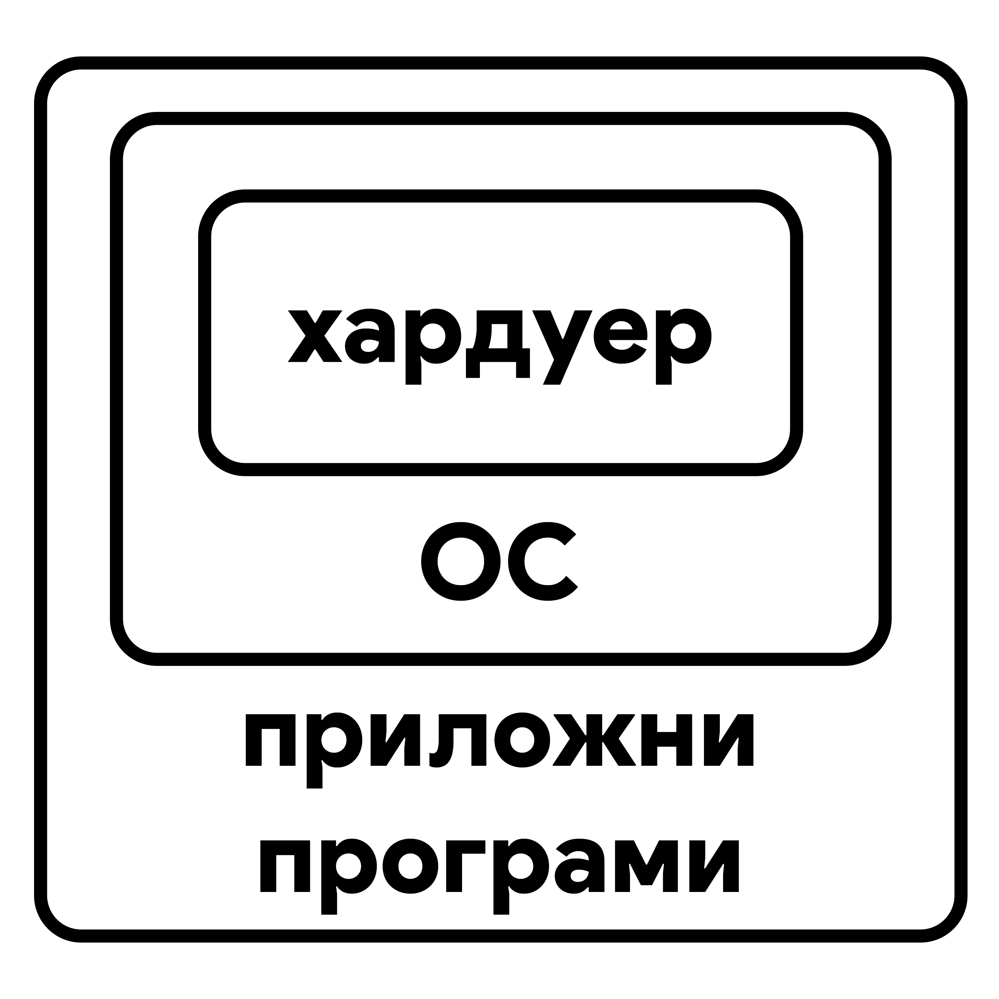
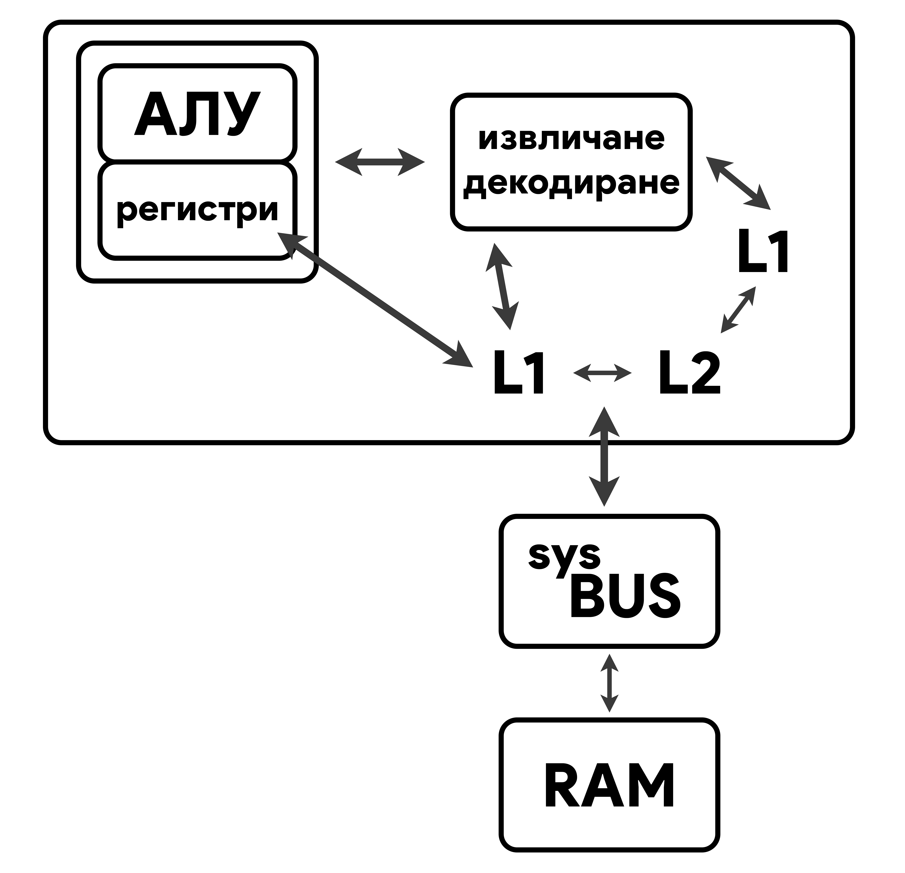
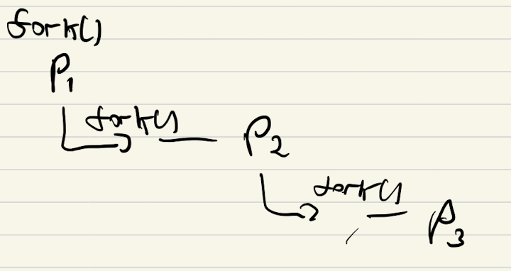
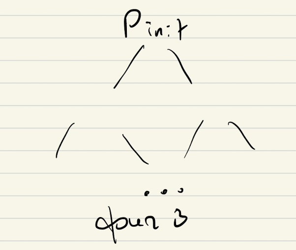
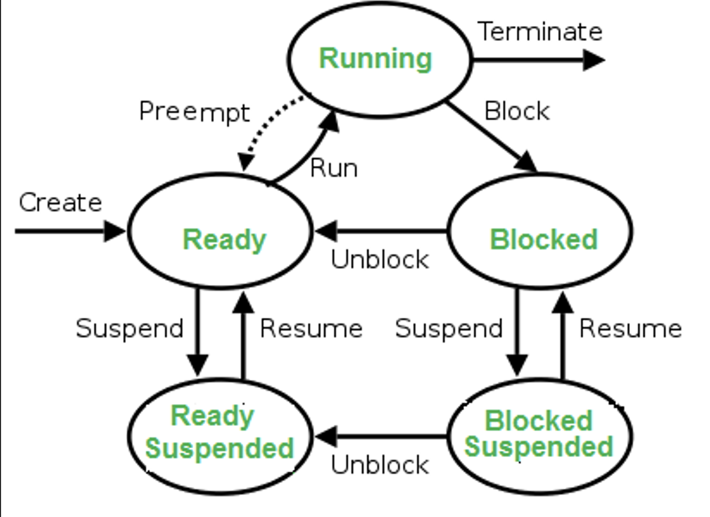

# So many questions

## Lecture 1

### ОС има две отговорности. Кои са те?

Опрерационните системи по своята същост имат за задача да:

- да управляват хардуера
- да предоставят интерфейс за приложните програми, за да може да работят с хардуера



### Какви типове хардуер управлява ОС? (общо 5, които сме учили). Каква функционалност има всеки от тези типовете хардуер?

Операционните системи управляват следните 5 типа хардуер:

- **_Централнен процесор (CPU - Central Processing Unit)_** - най-важният компонент от един копютър. Изчислява и изпълнява инструкции. Той има за цел да променя данните от паметта под някаква форма.
- **_Оперативна памет (RAM - Random Access Memory)_** - RAM паметта е най-просто казано бърза и енергозависима памет (т.е. ако спре захранването на дадена машина, данните ще бъдат изгубени) и точно, заради това идва и решението на този проблем - съхраняващите устройста. RAM паметта се използва за временно съхранение на изпълняващите програми и данни, които се използват от тях (инструкции, данни и контекст на процес)
- **_Съхраняващи усторйства (Storage Devices)_** - това са сравнително по-бавни устройства за записване и четене на данни, но за разлика от RAM паметта, те са енергонезависими и не се влияят от захранващото състояние на машината. Използват се за дълготрайно съхранение на данни, source code-ове, изпълними файлове и т.н.
- **_Входно-изходни устройства (Input-Output (I/O) Devices)_** - имат за цел да взимат и предават данни (информация) от и на потребителя
- **_Системна шина (System BUS)_** - това е хардуерен компонент, който е междинен слой за комуникация между компонентите. Подобна аналогия е с пътната инфраструктурна мрежа на една държава, която представлява логистичен мост между различните населени места.

### Какви елементи има централния процесор? За какво се ползват? Типове регистри. Кои са те и за какво се ползват? Контролни регистри. Кои сме учили и за какво се ползват?

1. **_АЛУ_** - Аритметико-логическия блок (Arithmetic Logic Unit) - използва se за извършване на аритметични операции и логически операции – събиране, изваждане, умножение, деление и сравняване на две числа. Това устройство обработва данните от регистрите на процесора и контролира скоростта на изчислителния процес. Като реално е изградено от логически елементи - "запоени писти за електрони".

1. **_Регистри (Registers)_** - те са най-бързата памет в една компютърна система и се разделят на 2 вида:

   1. **с общо предазначение** - използват се най-често за временно съхранение на данни (от ОС и приложните програми), от които процесора има най-бърз достъп до. Тези регистри също се делят на 2 подвида - регистри за данни и адресни регистри.
   1. **контролни регистри:** - използват се от ОС за управление на процесите и от самия централен процесор, за да контролира работата си
      - **_Програмен брояч (Program Counter (PC))_** - съхранява поредния номер на следващата инструкция, която трябва да се изпълни
      - **_Регистър за инструкция (Instruction Register (IR))_** - пази се инструкцията, която се изпълнява в момента. Всеки процесор има различен набор от инструкции и затова те си имат зададен номер – т.е. какво прави, примерно: 0 – запиши, 1 – събери и т.н, който зависи от архитектурата.
      - **_Регистър на състоянието (Program Status Word (PSW))_** - в него се съхраняват сервизната информация за операционната систмеа, [мета](https://i.kym-cdn.com/photos/images/original/002/237/750/454.jpg)данни.

1. **_Кеш памет (Cache Memory)_** - това е малка, но доста бърза памет, която се намира вътре във CPU-то. Тя се използва за да се запазят данните, които са използвани най-често, за да се ускори достъпа до тях. Това е доста важно, защото всяко извикване на данни от RAM паметта е доста по-бавно от това да се извика от кеш паметта. Kеш паметта бива L1, L2 и L3 (L3 от около 2000 година)

   - L1 - директно комуникира с регистрите. L1 се разделя на 2 части - L1D (Data) и L1I (Instruction). L1D съхранява данните, които са използвани най-често, а L1I съхранява инструкциите, които са използвани най-често. L1I минава през процес на извличане и декодиране на самите инструкции.
   - L2 & L3 - те представляват медиаторите между L1 и RAM паметта. Те са доста по-бавни от L1 (но и по-големи - L1:KB vs L2/3:MB), но са в пъти по-бързи от RAM паметта.



### Как ОС обработва прекъсвания? През какви етапи минава, защо?

Едно прекъсване (interrupt) може или да се игнорира, или да се обработи.

1. Когато се появи прекъсване, процесорът преминава в защитен режим на работа.
1. Като след това трябва да се реши дали ще се обработи това прекъсване.

   - Ако няма да се обработи - преминава се обратно към предходното състояние, преди самото прекъсване.

1. Ако реши да го обработи, първо запазва състоянието си на работа в момента и след това обработва прекъсването (изпълнява конкретна функция (базирано на типа прекъсване, etc.)).
1. След това продължава работата си.
1. Първо проверява дали има нови прекъсвания, подадени в момента на обработване на прекъсването. Прекъсванията се обработват по приоритет.
1. Като се обработят всички прекъсвания, процесорът възстановява нормалния си режим на работа.

За всеки тип прекъсване има Interrupt handler. Прекъсванията се пазят в приоритетна опашка. Interrupt handler се пази в RAM паметта.
**_Прекъсване не може да прекъсне обработката на прекъсване!_**

### Какви видове прекъсвания има? (общо 2). Дайте поне 2 примера за всеки.

Има както и хардуерни, така и софтуерни прекъсвания.

- Хардуерните

  Хардуерните прекъсвания се получават се от външни хардуерни компоненти, свързани към, или част от компютърната система.

  Примери:

  - Прекъсваия от входно-изходни устройства - за получаване или изпращане на данни или при настъпване на събитие (напр. приключило е дадена операция)
  - Прекъсвания от таймер - времеделни прекъсвани
  - Проблем с някое от хардуерните устройства на компютъра

---

- Софтуерните

  Софтуерните прекъсвания се получават се при проблеми с изпълнението на инструкциите на даден процес.

  Примери:

  - деление на нула
  - overflow
  - опит за достъп на памет, която не принадлежи на съответния процес
  - при предаване на контрола на ядрото и преминаването на процесора в привилегирован режим и обратно

### ОС предоставя 3 механизма за работа с входно-изходни у-ва. Кои са те и какви са характеристиките им?

Операционната система предоставя 3 механизма за работа с входно-изходни устройства:

- Синхронен входно-изходен механизъм (Synchronous I/O)

Oперационната система изисква от дадено устройство да свърши определена работа и влиза в безкраен цикъл (infinite loop). Като постоянно пита устройството дали си е свършило работата. Този цикъл едва ще приключи (brek-не) чак когато чак когато устройството си свърши работата.Тогава то дава резултата в буфер, който операционната система прехвърля в RAM паметта. Синхронно е, защото ОС не прави нищо друго, освен да чака, докато не получи сигнал, че работата е свършила.

- Асинхронен входно-изходен механизъм (Asynchronous I/O)

При асинхронния механизъм операционната система отново се допитва до устройството да свърши някаква работа. Но тук идва и разликата от синхронния тип. Докато В/И устройство си върши възложената задача, операционната система е свободна да върши други неща. И чак, когато е готово,устройството, то изпраща прекъсване (interrupt), което, при обработка от процесора, се handle-ва по същия начин като при синхронното: връща се резултат в буфера, който операционната система прехвърля в RAM паметта.

- Директен достъп до паметта (Direct Memory Access)

При ДДП операционната система казва на дадено устройство не само да изпълни някаква задача, но и да я запише само в RAM паметта и след това да му изпрати прекъсване (interrupt). Понеже не се получава резултат от входно-изходното устройство, при Direct Memory Access няма буфери, защото няма кой да ги обработи и устройството директно пише в паметта. Операционната система получава прекъсване от устройството чак след като то си е свършило работата и е прехвърлило резултата в RAM паметта.

## Lecture 2

### Структура на ОС. ОС може да се раздели на две части. Кои са те? Какво прави всяка от частите?

Операционната система може да се раздели на две части:

- Ядрото (Kernel) -

- Обвивката (Shell) -

### Разделихме ядрото на 5 части. Кои са те?

Ядрото може да се раздели на 5 части:

- Управление на процесите (Process Management)
- Управление на паметта (Memory Management)
- Управление на входно-изходните устройства (I/O Management)
- Управление на външно-запаметяващите устройства (Storage Management)
- Имплементация на защитна сигурност (Security)

### Какво е процес?

Процесът е програмата, когато се изпълнява.

### ОС може да извършва 4 операции с процеси, кои са те?

Операционната система може да извършва 4 операции с процеси:

- Създаване на процес (Process Creation)
- Терминиране (унищожаване) на процес (Process Termination)
- Спиране на процес (Process Suspension)
- Възстановяване на процес (Process Resume)

### Какво е файл?

При управлението на външно-запаметяващите устройства от ядрото, файлът е създаден като абстракция, илюзия, лъжа, създадена за да се улесни работата с данни.

Реално файлът е поредица от байтове на storage устройството.

### Какво е файлова система?

Файловата система също е абстракция за организирането на байтовете. Структуриране на байтове, директории, файлове, права за достъп до тези директории, организация и т.н.

### Какви операции можем да извършваме с/в-ху файлове?

aaa

### Какви видове защити има? Дайте по поне два примера за всеки.

Oперационната система предоставя защита, която представлява механизъм, който контролира достъпа на потребителите и процесите. Като се разделя на 2 части:

1. Хардуерна защита

Съществуването на привилегирован и непривилегирования режим има само набор от инструкции

- Да не се прецака ядрото и ОС
- ОС се намира в RAM – тя е защитена на хардуерно ниво – на това кои байтове мое да се достъпват от при неприв режм
- Има регистри, които определят тези адреси – BASE, LIMIT
- Таймерите на процесора – също защита – генерира се прекъсване, за да се премахне насилствено процес, за да се даде достъп до ОС
- Работата с в/и у-ва не може да се изпълняват в непр режим => използва се ядрото като middle man (хардуерна защита)

2. Софтуерна защита

- Само ядрото работи в привилегирован режим
- Кой потебител с кои файлове
- Всеки процес се асоциира с определено парче памет

### Какво е команден интерпретатор?

aaa

### Кaкво е системно извикване? Дайте поне 2 примера за системни извиквания.

Системните извиквания са функции, които се извикват от командния интерпретатор, за да се изпълнят някои операции.

Примери:

```
open(int fd, char *path, int flags, int mode);
```

```
read(int fd, void *buf, size_t count);
```

### Учихме 3 типа архитектури на ядра. Кои са те?

- Монолитни ядра (monolithic kernel)
- Многослоеви ядра (multilayer kernel)
- Микроядра (microkernel)

## Lecture 3

### В GNU/Linux има един начин за създаване на нов процес. Кой е той?

Системното извикване `fork()` - единственият начин да създадеш процес в GNU+Linux. Ако на даден процес P1 се извика `fork()`, то така се създава втори процес P2, който е почти индентичем. P2 може също да извиква `fork()` и да създаде P3 и т.н.



Това означава, че процесите се организират в йерархията. Имаме един процес _init_ – дядото на всички в GNU+Linux – the one to rule them all. И той има наследници с наследници и т.н.



### При създаване на нов процес ОС минава през 3 стъпки. Кои са те?

При създаването на нов процес операционната система минава през следните 3 стъпки:

1. Get pid – Опрерационната памет заделя за всеки процес има уникален индентификатор `pid` във времето. Като този индентификатор е уникално число, което може да се преизползва, след като процесът с даденото `pid` умре. `pid === ProcessID` и е позитивно число от 0 до 2^16. **_НЕ МОЖЕ ДА ИМА 2 ЕДНИ И СЪЩИ PID_**
2. Заделя памет и кои байтове ще съдържат инструкциите, данните и контекста на процеса
3. Инициализира се един контролен блок (CB - Control Block) – механизъм (структурата), който ОС използва, за да репрезентира процеси сама за себе си, затова всеки един процес има свой CB. Операционната система има масив от контролни блокове, наречен control block table).

### Обяснете следните понятия и връзката между тях:

    pid
    Control Block
    процес

Както вече разгледахме в преишната задача. PID е уникален идентификатор, който всеки процес притежава в даден момент.

PID се пази в контролния блок.

За всеки процес се инициализира определен контролен блок, в който се пази информация необходима за изпълнението на процеса (показана в следващата задача). Този контролен блок се намира в таблицата на ОС с контролни блокове.

### Каква информация се запазва в Control Block-овете?

- PID
- State – състоянието на процес\*
- Priority – приоритет за „алчните“ процеси (може да се променя постоянно)
- PC – пази се броячът на инструкциите (до къде сме ги изпълнили)
- Context (CPU) – конткест на процесота\*
- Meminfo – информация за паметта, която е алокирана за този процес (кои байтове / коя памет е заделена за този процес)
- I/O info – информация за работата със входно изходните устройсва, които работят с него – които този процес извършва
- (8) in use -> дали контролният блок се използва за процеса -> булева променлива. Така реално се убива процеса.

### В какви състояния може да се намира даден процес? Какъв е техният смисъл? При какви условия процес се намира във всяко от състоянията?

Oперационната система имплементира функционалността за състояноя на процесите - Processing State Machine:

1. **_НОВ (NEW)_** – при създаване (между нов и готов – ОС го инициализира)
2. **_ГОТОВ (READY)_** [Q] - има опашка от готови процеси, които очакват да се изпълнят
3. **_ИЗПЪЛНЯВАЩ СЕ (RUNNING)_**
   a. **_БЛОКИРАН (BLOCKED)_** [Q] - има опашка от блокирани процеси, които чакат да отидат в READY
   b. **_ГОТОВ (DONE)_** -> **_TERMINATE_**

Един новосъздаден процес е в състояние на _НОВ (NEW)_.

От нов става на _ГОТОВ (READY)_, което означава готов е за изпълнение, т.е. след като ОС напълно го е инициализирала. Сега процесът чака да в опашката на готовите процеси, за да може да се изпълни.

От готов може да отиде на _ИЗПЪЛНЯВАЩ СЕ (RUNNING)_ , т.е.изпълнява се в момента.

От готов един процес може **доброволно** да отиде в _БЛОКИРАН (BLOCKED)_ режим, понеже не се нуждае от процесорно време - примерно чака вход от потребителя.

Има два начина да се излезе от _ИЗПЪЛНЯВАЩ СЕ (RUNNIG)_ режим - доброволно (ако знаеш, че има да свършваш i/o работа) и насилствено – (за алчните процеси, които не дават процесорно време на останалите), затова всеки процес има таймер и когато изтече – насилствено се блокира, за да се даде процесорно време на останалите процеси, затова е необходимо да се осъществи _context switching_, който ще бъде разгледан в следващата задача.

- По-подробно обяснение на **_добровоно_** блокиране - Процесите от време на време стигат и до състояние, когато нямат полза (нужда) от процесорно време. Примерно да използваме i/o устройство, което е бавно в своята същност. Процесът трябва да чака. Затова процесът от _ГОТОВ (READY)_ режим отива **доброволно** в _БЛОКИРАН (BLOCKED)_ режим, докато не се случи нещото, което се чака. И след това се връща обратно.

Както беше споменато малко по-нагоре, има 2 различни опашки – с _ГОТОВИ (READY)_ (където процесите чакат процесорно време) и с _БЛОКИРАНИ (BLOCKED)_ (които чакат да бъдат отблокирани). И се базира на приоритет (т.е. приоритетна опашка).

Когато изпълнението на един процес се прекрати той става _ТЕРМИНИРАН_.




### Как се извършва context switching-а?

Тъй като върху един процесор може да се изпълнява само един процес в даден момент и заради това е въведено ограничение за това колко време един процес може да използва процесорно време, т.е. колко време може да е в стадий (режим) на _ИЗПЪЛНЯВАЩ СЕ (RUNNING)_.

Стадиите на context switching-а са следните:

1. CPU регистрите се записват в RAM
1. Обновяване на контролния блок и промяна на състоянието
1. Преместване на контролния блок в опашката на блокираните или в опашката на готовите процеси
1. Избиране на следващ процес
1. Обновяване на неговия контролен блок
1. Възстановяване на новия процес в процесорните регистри

## Misc

### Какви са разликите между следните типове памет:

`RAM · Disk · Registers`

Rегистрите се намират в централния процесор, те са най-бързият (от изброените) тип памет, но са в малко количество. RAM паметта е външна за процесора памет, като си комуникира с него чрез системната шина. RAM паметта е сравнително по-бавна от регистрите и от гледна точка на скорост, и на латенция, но за разлика от това е в пъти по-бърза от storage устройствата.Storage устройствата са външни устройства за съхранение на информация.

Друга разлика е, че регистрите и RAM паметта са енергозависими (т.е. при изключване на електричеството, информацията се изгубва), а storage устройствата са енергонезависими (т.е. информацията се съхранява дори и при изключване на електричеството). Което означава, че дисковите устройства имат напълно различна цел от RAM паметта и регистрите. Дисковите устройства се използват за съхранение на информация, която искаме да я запазим - примерно файлове (като документи), source код, изпълними файлове, самата операционна система (файловете, които трябва да се заредят при стартиране в RAM) и т.н.

RAM паметта се използва за временно съхранение на информация (данни, инструкции, процеси и т.н.), която искаме да я запазим за време на изпълнение на програма (програма, която се изпълнява се нарича процес) (например променливи, които се използват и т.н).

А пък регистрите се използват за съхранение на информация, която искаме да я запазим за време на изпълнение на инструкция, тъй като е изключително бърза и в самия процесор. Тези данни се изпиолзват АЛУ-то. (в този случай се говори за регистри за данни)

### Обяснете следните понятия:

- **_Кеширането (caching)_** е принцип, при който информацията (най-нужна от cpu-то) трябва се държи максимално близко до процесора в памет, която има бърз достъп, с цел бързина.

  Като така най-нужната информация (данни, инструкции, процеси, т.н.) се държи в най-бързата памет, най-близо до процесора, за да няма забавяния. Проблемът възниква, когато погледнем пазара и днешните технологични процеси (скорост, обем и бързина).

  Най-бързата памет са регистрите, последвани от L1 кеш, след това L2, L3, RAM паметта и така до storage устройствата. Обратното може да се каже за цената на паметта за един байт, където регистрите не могат да се сравняват с мегабайтите на кеш паметта, както и кеш паметта не може да се сравнява с гигабайтите на RAM паметта и т.н.

  Това е причината да има пъти по-малко регистри и кеш от RAM паметта. Което ни довежда, че кеширането трябва да е наистина оптимално и да се използва възможно най-много. Fun fact - кеш паметта всъщност заема най-много пространство от силиция на един процесор.

---

- **_Spooling_** - концепция за работа с I/O устройства, където разбиваме данните и/ли работата, която трябва да бъде свършена на малки части / компоненти, базирано на размера на буфера на самото входно-изходно устройство. След това подаваме тези части една по една на устройството. Тази концепция е създадена, за да се избегнат следните проблеми:

  - ценови проблем, където едно В/И устройство би изисквало изключително голям капацитет на буфер
  - непредвидимост - никой не може да предвиди точно какъв капацитет ще "угоди" на всички.
  - и още

  За пример може да се вземе един принтер, не само че всеки документ има различен брой страници, но и самите те имат свой собствен размер. Примерно един принтер може да има буфер от 128MB, но документът, който трябва да отпечата е в пъти по-голям. И затова данните се разбиват на chunk-ове и се подават на принтера.

---

- **_Многозадачност_** - Операционната система създава илюзия (абстракция) за паралелно изпълнение на програми. Обаче в реалността\* обработката на инструкции е последователна. разделя работата за изключително бърз период от милисекунди. Илюзията за многозадачност (паралелно изпълнение) се постига чрез използване на таймери, които генерират прекъсвания на определено време (интервал). Тези прекъсвания сменят процеса (задачата), която се изпълнява.

  \*технически в реалността се изпълнпват и много задачи, ако процесорът е многоядерен (и може би ако има няколко логически ядра (не съм сигурен за лог. ядрата обаче)).

  Иначе цялото това нещо (илюзията) се постига благодарение на невероятната скорост на днешните процесори. (говоря за едноядерни процесори тук :))

---

- **_Многопотребителност_** - в реална среда компютрите се използват от много потребители. Многопотребителността е способността на операционната система да поддържа различни (множество) потребители. Като така се постига енкапсулация. Дадени потребители да имат достъп до дадени файлове и директории. Както и всеки потребител да си има права / правомощия. В GNU+Linux има 2 типа потребители: привилегирован (root) и непривилегирован.

---

- **_Времеделение_** - това е разделянето на процесорното време между отделните процеси, които се изпълняват. Както вече споменахме, това се използва именно в многозадачността, тъй като на един процесор в дадено време може да се изпълнпва само един процес. Процесите изпълняващи се на един процесор се сменят на много кратко време, в зависимост от приоритета им, като времеделението се извършва чрез таймери, които генерират прекъсвания на определено време (интервал). Тези прекъсвания сменят процеса (задачата), която се изпълнява за крато и този процес "времеделение" се повтаря.
